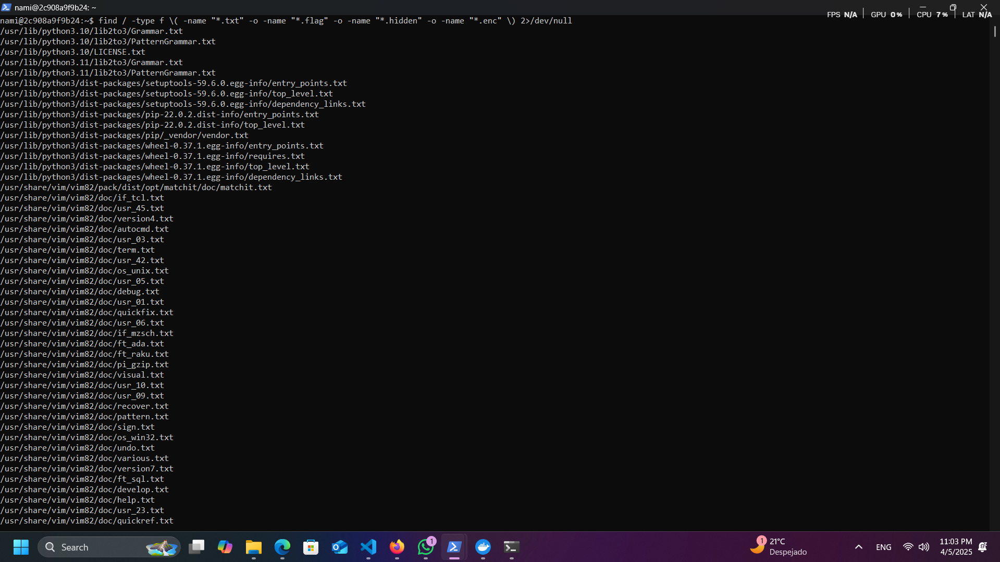

## COMMITS HISTORY
En estas capturas de pantalla, se deja registro de los commits que fueron parte del proceso para solución de este proyecto.  
Esto pues, en un principio se había realizado un *fork* y se trabajó en ese *fork*, pero era imposible hacerlo privado, a menos que el repositorio original también lo fuera.  
Así que mientras tanto, lo hice en otro repositorio, que sí es privado, y permite hacerlo más propio.


---

## Clone de proyecto. Instalacion librerias python
Se hace **clone** del repositorio en una carpeta nueva (con un nombre distintivo que incluye “P1” para diferenciarlo del original).

Luego, se ejecuta:

```bash
docker compose up -d
```

Este comando levanta los contenedores definidos en el archivo `docker-compose.yml`.  
- `up` indica que se deben crear e iniciar los contenedores.
- `-d` ejecuta los contenedores en modo *detached* (en segundo plano), lo cual permite seguir usando la terminal mientras los servicios corren.


Una vez levantados los 4 contenedores, y generada la data necesaria, se procede a resolver los desafíos.


---

## LUFFY – XOR Cifrado Simple
**Dificultad:** Fácil

**Descripción:**
Se encontró un archivo `flag.txt` que contenía una cadena hexadecimal encriptada. Aplicando la técnica de **XOR** con una clave basada en el carné del estudiante, se logró desencriptar la bandera.

**Pasos clave:**
- Se accedió al contenedor `luffy_challenge`.
- Se utilizó `grep` y `find` para localizar archivos relevantes.
- Se obtuvo el archivo `flag.txt` con la bandera encriptada.
- Se aplicó XOR con la clave personalizada.

**Flag encontrada:** `FLAG_0a16e1e85da2dc414b4447cd580d63f3`

**Aprendizaje:** El cifrado XOR, aunque simple, es efectivo si la clave es suficientemente aleatoria y desconocida. Aquí se reforzó el entendimiento del cifrado simétrico básico.

## COMANDOS

Se ejecuta el contenedor

```bash
docker exec -it luffy_challenge /bin/bash
```

Esto permite ingresar al contenedor `luffy_challenge` con una terminal interactiva (`-it`) y utilizar `/bin/bash` como shell. Esto es útil para explorar el sistema de archivos dentro del contenedor y ejecutar comandos.
Tomar en cuenta que se realizo desde windows.


---

### Acceso como usuario del reto:
```bash
su - luffy
# Contraseña: onepiece
```

### En caso de requerir instalar herramientas, utilizar
En caso de necesitar herramientas como .zip o alguna extra, se utiliza el comando para poder instalarlo, caso
contrario, no se pueden utilizar las herramientas.
```bash
docker exec -u root -it luffy_challenge /bin/bash
```
Este comando permite ingresar como **root**, lo cual es útil para instalar herramientas que no estén disponibles por defecto.


Para poder hallar las flags o valores necesarios, se hizo un
```bash
grep -r --color=auto "flag" / 2>/dev/null
```
Este comando busca recursivamente (con `-r`) cualquier texto que contenga la palabra "flag" desde la raíz del sistema. Se ignoran los errores de permisos (`2>/dev/null`).


```bash
find / -type f \( -name "*.txt" -o -name "*.flag" -o -name "*.hidden" -o -name "*.enc" \) 2>/dev/null

```
Busca en todo el sistema archivos con extensiones `.txt`, `.flag`, `.hidden` o `.enc`.  
- `-type f`: solo busca archivos.  
- `\(...\)`: agrupa condiciones.  
- `-o`: actúa como operador lógico OR.  
- `2>/dev/null`: suprime errores (como falta de permisos).

---

```bash
find /home/luffy/ONEPIECE/ -type f -name "flag.txt" -exec cat {} + 2>/dev/null
```
Busca el archivo `flag.txt` dentro de `/home/luffy/ONEPIECE/` y muestra su contenido:  
- `-exec cat {} +`: imprime el contenido de los archivos encontrados.  
- `2>/dev/null`: ignora errores de permisos.


---

### Bandera encriptada y desencrpitada respectivamente
```bash
747d70776d045300075503510a04555100505105000450000605065356010a015506015201
FLAG_0a16e1e85da2dc414b4447cd580d63f3
```


```bash
find / -name "*.zip" 2>/dev/null
```
Busca archivos `.zip` en todo el sistema de archivos.


```bash
find / -name "*.jpg" -o -name "*.png" 2>/dev/null
```
Busca archivos con extensión `.jpg` o `.png`.  
- `-o`: operador OR para combinar ambas extensiones.  
- `2>/dev/null`: suprime errores por falta de permisos.


---

### La contraseña para poder acceder a la imagen del .zip es la misma que la utilizada para ingresar al primer contenedor

```bash
docker cp luffy_challenge:/home/luffy/ONEPIECE/Zou/Left_Hind_Leg/Casa_de_Inuarashi/poneglyph.zip C:\Users\arg21\OneDrive\Documents\uvg\ctf_onepiece_symetric_cipher_p1\resultados/part1
```
Copia el archivo `poneglyph.zip` desde la ruta interna del contenedor `luffy_challenge` hacia la carpeta local `./onepiece`:
- `docker cp`: copia archivos entre contenedor y host.
- `luffy_challenge:...`: indica el contenedor y la ruta de origen.
- `./resultados/part1`: destino en el host local.


---

### Texto decifrado de la imagen
b'Crocodile targeted the Arabasta Kingdom because of its Poneglyph, which contained information on the whereabouts of Pluton, '

---

ejecutar el comando en la raiz del proyecto
```bash
python utils/extract_text_from_image.py
```
Ejecuta un script de Python para extraer texto de una imagen.
- El script probablemente hace uso de herramientas como **Tesseract OCR**.
- La salida suele mostrar texto oculto o codificado en las imágenes relacionadas al reto.


---

## ZORO – Romper cifrado RC4
**Dificultad:** Media

**Descripción:**
Este reto implicó la lectura de una flag cifrada usando un esquema similar al algoritmo **RC4**. La flag debía descifrarse utilizando una implementación inversa del flujo de cifrado.

**Pasos clave:**
- Se ingresó al contenedor `zoro_challenge`.
- Se localizó `flag.txt` con contenido cifrado.
- Se aplicaron scripts para emular el flujo de claves y revertir el cifrado tipo RC4.

**Flag encontrada:** `FLAG_71fb5f88e9a62612bd9c1d030b1cab53`

**Aprendizaje:** Entender cómo funciona un cifrado por flujo como RC4, y cómo puede ser reversible si se conoce el esquema y la clave.

---

## COMANDOS
```bash
    docker exec -it zoro_challenge /bin/bash
```
Esto permite ingresar al contenedor `zoro_challenge` con una terminal interactiva (`-it`) y utilizar `/bin/bash` como shell. Esto es útil para explorar el sistema de archivos dentro del contenedor y ejecutar comandos.
Tomar en cuenta que se realizo desde windows.


### Lectura de los archivos .txt o cualquier .* que pueda servir

```bash
    find / -type f \( -name "*.txt" -o -name "*.flag" -o -name "*.hidden" -o -name "*.enc" \) 2>/dev/null
```
Busca en todo el sistema archivos con extensiones `.txt`, `.flag`, `.hidden` o `.enc`.  
- `-type f`: solo busca archivos.  
- `\(...\)`: agrupa condiciones.  
- `-o`: actúa como operador lógico OR.  
- `2>/dev/null`: suprime errores (como falta de permisos).


### Este comando sirve para hacer una cat de cada uno, y tenerlo mas ordenado que en el caso anterior. Se ve mejor y legible la verdad
```bash
    for file in $(find /home/zoro -name "flag.txt"); do
        echo "=== $file ==="
        cat "$file"
        echo ""
    done
```


### Bandera encriptada y desencrpitada respectivamente
```bash
    c5c698284ebf7b97371a0e693bc84a6fd1bb76346e9dc6d62d0dffe5b8f06d16d53b3d1967
    FLAG_71fb5f88e9a62612bd9c1d030b1cab53
```


```bash
find / -name "*.zip" 2>/dev/null
```
Se hace busqueda de los .zip en el sistema. Esto ayudo a hacer una barrido general de todos los archivos

### Copia a carpeta de windows
```bash
docker cp zoro_challenge:/home/zoro/ONEPIECE/Zou/Right_Hind_Leg/Casa_de_Inuarashi/poneglyph.zip "C:\Users\arg21\OneDrive\Documents\uvg\ctf_onepice_symmetric_cipher_p1\resultados\part2"
```
Copia el archivo `poneglyph.zip` desde la ruta interna del contenedor `zoro_challenge` hacia la carpeta local `./onepiece`:
- `docker cp`: copia archivos entre contenedor y host.
- `zoro_challenge:...`: indica el contenedor y la ruta de origen.
- `./resultados/part2: destino en el host local.


### Texto decifrado de la imagen
b'and created the Baroque Works syndicate in an attempt to bring down the Arabasta Kingdom and claim Pluton, employing Robin to read the Poneglyph'

---

ejecutar el comando en la raiz del proyecto
```bash
python utils/extract_text_from_image.py
```
Ejecuta un script de Python para extraer texto de una imagen.
- El script probablemente hace uso de herramientas como **Tesseract OCR**.
- La salida suele mostrar texto oculto o codificado en las imágenes relacionadas al reto.


---

## USOPP – Stream Cipher Personalizado
**Dificultad:** Media

**Descripción:**
Se presentó un cifrado por flujo con un generador personalizado, no estándar. Requirió analizar la estructura del archivo cifrado y aplicar ingeniería inversa para deducir el método de generación del flujo.

**Pasos clave:**
- Se accedió al contenedor `usopp_challenge`.
- Se encontró la flag cifrada.
- Se descifró mediante código propio que replicaba el flujo de cifrado personalizado.

**Flag encontrada:** `FLAG_6290739e295d64e0c37f4d839d2f3182`

**Aprendizaje:** Se profundizó en el diseño de cifrados por flujo personalizados y cómo su debilidad radica en la predictibilidad del generador.

---

## COMANDOS

```bash
    docker exec -it usopp_challenge /bin/bash
```
Esto permite ingresar al contenedor `usopp_challenge` con una terminal interactiva (`-it`) y utilizar `/bin/bash` como shell. Esto es útil para explorar el sistema de archivos dentro del contenedor y ejecutar comandos.
Tomar en cuenta que se realizo desde windows.

```bash
    find / -type f \( -name "*.txt" -o -name "*.flag" -o -name "*.hidden" -o -name "*.enc" \) 2>/dev/null
``` 
Busca en todo el sistema archivos con extensiones `.txt`, `.flag`, `.hidden` o `.enc`.  
- `-type f`: solo busca archivos.  
- `\(...\)`: agrupa condiciones.  
- `-o`: actúa como operador lógico OR.  
- `2>/dev/null`: suprime errores (como falta de permisos).


### Este comando sirve para hacer una cat de cada uno, y tenerlo mas ordenado que en el caso anterior. Se ve mejor y legible la verdad
```bash
    for file in $(find /home/usopp -name "flag.txt"); do
        echo "=== $file ==="
        cat "$file"
        echo ""
    done
```
1. `find /home/zoro -name "flag.txt"` busca todos los archivos con ese nombre dentro del directorio del reto.
2. Por cada archivo encontrado, se imprime su ruta (`echo "=== $file ==="`) y su contenido (`cat "$file"`).
3. `echo ""` añade una línea en blanco para mejorar la legibilidad.

Este método permite revisar múltiples archivos `flag.txt` fácilmente, mostrando cada uno separado y bien organizado, ideal cuando hay más de una flag potencial o para validar contenido cifrado.


---

### Bandera encriptada y desencrpitada respectivamente
```bash
    a77742694e1c008c493f3c31d4c5d4794a6b0e62c91c12d9451973b213a39287ee4c57d03b
    FLAG_6290739e295d64e0c37f4d839d2f3182
```

```bash
find / -name "*.zip" 2>/dev/null
```
Se hace busqueda de los .zip en el sistema. Esto ayudo a hacer una barrido general de todos los archivos


### Copia a carpeta de windows
```bash
docker cp usopp_challenge:/home/usopp/ONEPIECE/Wano/Onigashima/Casa_de_Yamato/poneglyph.zip "C:\Users\arg21\OneDrive\Documents\uvg\ctf_onepice_symmetric_cipher_p1\resultados\part3"
```
Copia el archivo `poneglyph.zip` desde la ruta interna del contenedor `usopp_challenge` hacia la carpeta local `./onepiece`:
- `docker cp`: copia archivos entre contenedor y host.
- `usopp_challenge:...`: indica el contenedor y la ruta de origen.
- `./resultados/part3: destino en el host local.


### Texto decifrado de la imagen
 b'When Robin finally got the chance to read this Poneglyph, however, she lied about its contents, which caused Crocodile to turn against her because he no longer needed her'

---

ejecutar el comando en la raiz del proyecto
```bash
python utils/extract_text_from_image.py
```
Ejecuta un script de Python para extraer texto de una imagen.
- El script probablemente hace uso de herramientas como **Tesseract OCR**.
- La salida suele mostrar texto oculto o codificado en las imágenes relacionadas al reto.


---

## NAMI – ChaCha20 Playground
**Dificultad:** Media

**Descripción:**
La flag estaba cifrada usando **ChaCha20**, un algoritmo moderno y seguro. Se proporcionaban todos los parámetros necesarios (clave, nonce), por lo que el desafío era más técnico en cuanto al uso correcto del algoritmo.

**Pasos clave:**
- Acceso al contenedor `nami_challenge`.
- Se localizó el archivo cifrado.
- Se utilizó una implementación correcta de ChaCha20 para descifrar la flag.

**Flag encontrada:** `FLAG_c8886f1b7ab0ee2d4e12db4db5d2d4a9`

**Aprendizaje:** El uso práctico de cifrados modernos como ChaCha20 refuerza conocimientos sobre seguridad real en sistemas actuales.

---

```bash
    docker exec -it nami_challenge /bin/bash
```
Esto permite ingresar al contenedor `nami_challenge` con una terminal interactiva (`-it`) y utilizar `/bin/bash` como shell. Esto es útil para explorar el sistema de archivos dentro del contenedor y ejecutar comandos.
Tomar en cuenta que se realizo desde windows.


## COMANDOS
```bash
    find / -type f \( -name "*.txt" -o -name "*.flag" -o -name "*.hidden" -o -name "*.enc" \) 2>/dev/null
``` 
Busca en todo el sistema archivos con extensiones `.txt`, `.flag`, `.hidden` o `.enc`.  
- `-type f`: solo busca archivos.  
- `\(...\)`: agrupa condiciones.  
- `-o`: actúa como operador lógico OR.  
- `2>/dev/null`: suprime errores (como falta de permisos).



### Este comando sirve para hacer una cat de cada uno, y tenerlo mas ordenado que en el caso anterior. Se ve mejor y legible la verdad
```bash
    for file in $(find /home/nami -name "flag.txt"); do
        echo "=== $file ==="
        cat "$file"
        echo ""
    done
```

1. `find /home/zoro -name "flag.txt"` busca todos los archivos con ese nombre dentro del directorio del reto.
2. Por cada archivo encontrado, se imprime su ruta (`echo "=== $file ==="`) y su contenido (`cat "$file"`).
3. `echo ""` añade una línea en blanco para mejorar la legibilidad.

Este método permite revisar múltiples archivos `flag.txt` fácilmente, mostrando cada uno separado y bien organizado, ideal cuando hay más de una flag potencial o para validar contenido cifrado.


---

### Bandera encriptada y desencrpitada respectivamente
```bash
    3fc06ae08a1da3b0dfdd6cdf052435026360b73d778607f9c81ba4c5e3608269653ce10237
    FLAG_c8886f1b7ab0ee2d4e12db4db5d2d4a9
```

```bash
find / -name "*.zip" 2>/dev/null
```
Se hace busqueda de los .zip en el sistema. Esto ayudo a hacer una barrido general de todos los archivos


```bash
docker cp nami_challenge:/home/nami/ONEPIECE/Whole_Cake_Island/Whole_Cake_Chateau/Casa_de_Big_Mom/poneglyph.zip "C:\Users\arg21\OneDrive\Documents\uvg\ctf_onepice_symmetric_cipher_p1\resultados\part4"
```
Copia el archivo `poneglyph.zip` desde la ruta interna del contenedor `nami_challenge` hacia la carpeta local `./onepiece`:
- `docker cp`: copia archivos entre contenedor y host.
- `nami_challenge:...`: indica el contenedor y la ruta de origen.
- `./resultados/part4: destino en el host local.


### Texto decifrado de la imagen
b'the Tomb of the Kings where the Poneglyph was held became unstable and began collapsing around them.'
---

ejecutar el comando en la raiz del proyecto

```bash
python utils/extract_text_from_image.py
```
Ejecuta un script de Python para extraer texto de una imagen.
- El script probablemente hace uso de herramientas como **Tesseract OCR**.
- La salida suele mostrar texto oculto o codificado en las imágenes relacionadas al reto.


## Reflexión Final

Este proyecto permitió aplicar conocimientos prácticos sobre criptografía simétrica, manipulación de contenedores Docker, y técnicas de análisis de archivos cifrados o escondidos. Cada reto presentó un nivel de dificultad creciente, lo cual ayudó a reforzar distintas habilidades:

- Comprender e implementar XOR manualmente.
- Aplicar lógica inversa a cifrados por flujo como RC4.
- Descifrar algoritmos personalizados a través de ingeniería inversa.
- Trabajar con cifrados modernos como ChaCha20 de forma segura.
- Extraer información de imágenes utilizando OCR.

Además, se fortaleció la capacidad para trabajar con entornos Linux, automatizar tareas con comandos de terminal, y documentar de forma clara cada paso del proceso. Esta experiencia representa una excelente base para desafíos más complejos de ciberseguridad y CTF.
